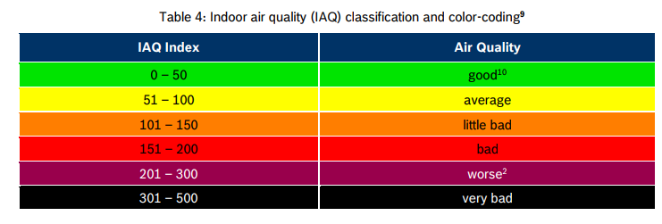

# BME680

**this is still a work in progress**

As the name suggest this fork was intially created to integrate a BME680 (instead of BME280) using the BSEC framework (so I removed the compiled version of the firmware as requested by the BOSCH license). Then I modified a lot of other things. Please refer to the original projects for all other details.

   - I'm planning to put a 3.3v regulator (the BME680 seems to have some problems with the integrated D1 3.3 V regulator)
   - The OLED display format and HA entities are modified accordingly to show the additional parameters (expecially the IAQ) from the BSEC library.
   - LEDs are changed to:
     - LED1 IAQ by BOSCH sensor
     - LED2 AQI by EEA
     - LED3 CO2 (I'm planning to use this for both CO2 and PM2.5) 
   - the "wifi" section is now moved to includes/wifi_secrets.yaml (you have to create the file yourself with correct informations)
     

original project video:
[](https://www.youtube.com/watch?v=X75OGs2TTT8)


## 1. PCB

Nothing changed here.

## 2. Holder case


Nothing changed here. 
 
## 3. Microcontroller Board


[Wemos D1 Mini board](https://docs.wemos.cc/en/latest/d1/d1_mini.html) used.


## 4. Dust Sensor


Nothing changed here. 

## 5. CO2 sensor


Nothing changed here. 

## 6. Temperature/Humidity/Pressure sensor


Original project used a BME280 here, but I had some spare [Bosch BME680](https://cdn-shop.adafruit.com/product-files/3660/BME680.pdf) around.

**since it's seems impossible to find a 3.3v only for the BME680 (voltage regulator which can theoretically warm the board and change the temperature reading), I simply used a BMP280 board where I put the BMR680 (they are pin compatible)**

Table from the BOSCH datasheet:


## 7. Ambient Light Sensor

Nothing changed here. (I tried a [TCS34725] (https://esphome.io/components/sensor/tcs34725.html) almost pin compatile (it requires a bridge between pin 2 and 4) but at the end the footprint is too different).

## 8. LEDs


Nothing changed here

**Colors of the LEDs depends on this table:**
BOSCH IAQ<br>LED 1 | [AQI by EEA (Air Quality Index for PM2.5 24h average)](https://airindex.eea.europa.eu/Map/AQI/Viewer/)<br>LED 2 | CO2 value (ppm)<br>LED 3 | Color |  R  |  G  |  B
:-----------------: | :-------------: | :-------------: | :---: | :-: | :-: | :-: 
< 50 | < 10 (Good) | < 700 |  | off | on | off 
51 - 100 | 10 - 20 (Fair) | 700 - 1000 |  | off | on | on 
101 - 150 | 20 - 25 (Moderate) | 1000 - 1500 |  | on | on | off 
151 - 200 | 25 - 50 (Poor) | 1500 - 2100 |  | on | off | on 
\> 201 | > 50 (Very Poor) | > 2100 |  | on | off | off 

## 9. Displays

Nothing changed here

## 10. Volatile Organic Compound sensor

this is not present anymore, since I'm using BME680 for the IAQ and eCO2.

## 11. Other electrical components


Nothing changed here

# User manual
It's quite simple, the device have only one "multi functional" button SW1, and one micro button SW2 for calibration of the CO2 sensor.

### Multi function button
- Short press "rotates" the data displayed on the right bigger display. By default it starts showing only PM2.5 and CO2 with larger fonts as these are the most important air quality parameters. This is also the default "screen" and every time the device is restarted it will show that screen. The display is quite small (128x64 pixels) so some of the text is shortened like P1 (for PM1), C (for CO2), etc. Each short press of the button rotates this sequence:
```
DEFAULT==================================================================MIN/MAX===============
PM2.5      AQI        Temperature    PM1         Amb.Light  PM1         Temp. MIN        Displays OFF
CO2 ----> Index ----> Humidity ----> PM2.5 ----> TVOC ----> PM2.5 ----> PM2.5 MIN ----> (both displays  
 ^      PM2.5 24h     Pressure       PM10        eCO2       PM10        CO2 MIN          turned off)
 |                                                          Temperature Temp. MAX             |
 |                                                          Humidity    PM2.5 MAX             |
 |                                                          Pressure    CO2 MAX               |
 | _ _ _ _ _ _ _ _ _ _ _ _ _ _ _ _ _ _ _ _ short click_  _ _ _ _ _ _ _ _ _ _ _ _ _ _ _ _ _ _ _|
```

- Press and hold the button from **2 to 5 sec**: On the display you see `LEDs status: OFF`. This means the status LEDs will be tuned off. Do the same to toggle back to `LEDs status: ON`. This setting is saved in the non volatile memory, so it will keep it's setting even if the MCU is restarted. 
- Press and hold the button from **5 to 10 sec**: On the display you see `Night dim: OFF`. This means the LEDs and displays will not be turned off if ambient light fall under 2 lux. Do the same to toggle back to `Night dim: ON`. This setting is saved in the non volatile memory, so it will keep it's setting even if the MCU is restarted. 
- Press and hold from **10 to 15 sec**: On the display you see `MIN-MAX Reset!`. It reset the minimum and maximum values of temperature, PM2.5 and CO2 on screen 6. Please note these resets each time the device is restarted. Keep in mind that 1.5 min after boot and reset, values of CO2 and temperature might not be correct.
- Press and hold from **15 to 20 sec**: It will increase LED brightness correction with +5%. When it reaches +40% another press and hold will make it 0% again. 
- Press and hold from **20 to 30 sec**: On the display for 20 sec it will show the following diagnostic data:
```
YAML ver: (shows version of the esphome yaml config)
ESPHome ver: (ESPHome version which build the firmware)
IP: (IP address if connected to WiFi)
Connected to: (SSID of the wifi, if connected)
LED brightness: (brigtness correction of the LEDs)
```
### LED Brightness control and correction

**this seems to have some problems with my particulars LEDs. needs more investigation.**

Led brightness is controlled periodically (each 3 sec), proportional of the ambient light measured by the TLS2561 sensor. If there is no ambient light sensor installed LEDs are constant at 25%, but auto turn off will also not work. Logic of this simple auto control is configured in [this code](firmware/includes/brightness.yaml).

Also by default setting of these LEDs are to begin from 11% brightness. If it's bellow 11% they are turned off. As mentioned in the LED description setting these Chinese LEDs comes with different intensity and the ones listed in Bill of Materials section are too weak at the lowest setting. That's why I added brightness correction setting which can go from 0% to +40% in 5% step. This be done with press and hold the multi function button from 15 to 20 sec (explained above). This setting is saved in the non volatile memory of the MCU and it does not have to be configured after each reset. Alternatively if the device is added in Home Assistant, you will see a template switch called `brightness_correction`, which is doing exactly the same thing as the button on pin.

# License 
The device is [Open-source hardware](https://en.wikipedia.org/wiki/Open-source_hardware), [licensed by Open Source Hardware Association](https://certification.oshwa.org/bg000078.html). 

- Hardware is licensed under [CERN-OHL-W v2](https://ohwr.org/cern_ohl_w_v2.txt).
- Software is licensed under [Apache License 2](https://www.apache.org/licenses/LICENSE-2.0)
- Documentation is licensed under [CC-BY-SA-4.0](https://creativecommons.org/licenses/by-sa/4.0/). 


